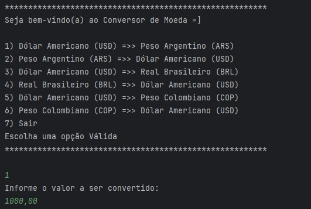
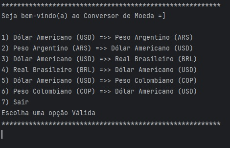
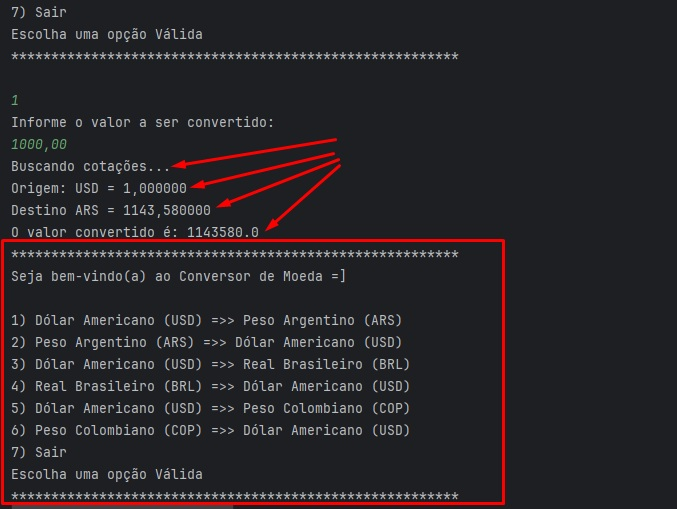

# Índice 

* [Apresentação](#Apresentação)
* [Descrição do Projeto](#Descrição)
* [Status do Projeto](#Status)
* [Funcionalidades e Demonstração da Aplicação](#Funcionalidades)
* [Cadastrando seus Amigos](#Cadastrando)
* [Desenvolvimento](#Desenvolvimento)
* [Tecnologias utilizadas](#Tecnologias)
* [Licença](#Licença)
* [Conclusão](#Conclusão)

# Apresentação

# Descrição

Projeto criado em Mai/2025, como fruto de aprendizado em programação em Java disponibilizado pelo Projeto ONE (Oracle + Alura).

Esta ferramenta demonstra lógica de programação com a utilização de API externa (https://www.exchangerate-api.com/) e com a conversão de valores.

O objetivo desta ferramenta consiste na "Conversão de Valores" entre 02 (duas) moedas distintas, conforme a escolha em um menu, optando entre o Dólar Americano (USD), Peso Argentino (ARS), Real (BRL) e o Peso Colombiano (COP).

# Status

Este projeto encontra-se CONCLUÍDO, tomando como base as orientações fornecidas através dos cards via Trello, tendo sido utilizada a ferramenta IntelliJ para seu desenvolvimento.

Algumas melhorias podem ser aplicadas, aumentando as possibilidades de conversões para várias outras moedas, uma vez que a consulta realizada via API já retorna cotações para as seguintes moedas:
CóD - DESCRIÇÃO
AED - UAE Dirham Emirates
AFN - Afghan Afghani
ALL - Albanian Lek
AMD - Armenian Dram
ANG - Netherlands Antillian Guilder
AOA - Angolan Kwanza
ARS - Argentine Peso
AUD - Australian Dollar
AWG - Aruban Florin
AZN - Azerbaijani Manat
BAM - Bosnia and Herzegovina Convertible Mark
BBD - Barbados Dollar
BDT - Bangladeshi Taka
BGN - Bulgarian Lev
BHD - Bahraini Dinar
BIF - Burundian Franc
BMD - Bermudian Dollar
BND - Brunei Dollar
BOB - Bolivian Boliviano
BRL - Brazilian Real
BSD - Bahamian Dollar
BTN - Bhutanese Ngultrum
BWP - Botswana Pula
BYN - Belarusian Ruble
BZD - Belize Dollar
CAD - Canadian Dollar
CDF - Congolese Franc
CHF - Swiss Franc
CLP - Chilean Peso
CNY - Chinese Renminbi
COP - Colombian Peso
CRC - Costa Rican Colon
CUP - Cuban Peso
CVE - Cape Verdean Escudo
CZK - Czech Koruna
DJF - Djiboutian Franc
DKK - Danish Krone
DOP - Dominican Peso
DZD - Algerian Dinar
EGP - Egyptian Pound
ERN - Eritrean Nakfa
ETB - Ethiopian Birr
EUR - Euro
FJD - Fiji Dollar
FKP - Falkland Islands Pound
FOK - Faroese Krina
GBP - Pound Sterling
GEL - Georgian Lari
GGP - Guernsey Pound
GHS - Ghanaian Cedi
GIP - Gibraltar Pound
GMD - Gambian Dalasi
GNF - Guinean Franc
GTQ - Guatemalan Quetzal
GYD - Guyanese Dollar
HKD - Hong Kong Dollar
HNL - Honduran Lempira
HRK - Croatian Kuna
HTG - Haitian Gourde
HUF - Hungarian Forint
IDR - Indonesian Rupiah
ILS - Israeli New Shekel
IMP - Manx Pound
INR - Indian Rupee
IQD - Iraqi Dinar
IRR - Iranian Rial
ISK - Icelandic Kr\u00f3na
JEP - Jersey Pound
JMD - Jamaican Dollar
JOD - Jordanian Dinar
JPY - Japanese Yen
KES - Kenyan Shilling
KGS - Kyrgyzstani Som
KHR - Cambodian Riel
KID - Kiribati Dollar
KMF - Comorian Franc
KRW - South Korean Won
KWD - Kuwaiti Dinar
KYD - Cayman Islands Dollar
KZT - Kazakhstani Tenge
LAK - Lao Kip
LBP - Lebanese Pound
LKR - Sri Lanka Rupee
LRD - Liberian Dollar
LSL - Lesotho Loti
LYD - Libyan Dinar
MAD - Moroccan Dirham
MDL - Moldovan Leu
MGA - Malagasy Ariary
MKD - Macedonian Denar
MMK - Burmese Kyat
MNT - Mongolian T\u00f6gr\u00f6g
MOP - Macanese Pataca
MRU - Mauritanian Ouguiya
MUR - Mauritian Rupee
MVR - Maldivian Rufiyaa
MWK - Malawian Kwacha
MXN - Mexican Peso
MYR - Malaysian Ringgit
MZN - Mozambican Metical
NAD - Namibian Dollar
NGN - Nigerian Naira
NIO - Nicaraguan C\u00f3rdoba
NOK - Norwegian Krone
NPR - Nepalese Rupee
NZD - New Zealand Dollar
OMR - Omani Rial
PAB - Panamanian Balboa
PEN - Peruvian Sol
PGK - Papua New Guinean Kina
PHP - Philippine Peso
PKR - Pakistani Rupee
PLN - Polish Z\u0142oty
PYG - Paraguayan Guaran\u00ed
QAR - Qatari Riyal
RON - Romanian Leu
RSD - Serbian Dinar
RUB - Russian Ruble
RWF - Rwandan Franc
SAR - Saudi Riyal
SBD - Solomon Islands Dollar
SCR - Seychellois Rupee
SDG - Sudanese Pound
SEK - Swedish Krona
SGD - Singapore Dollar
SHP - Saint Helena Pound
SLE - Sierra Leonean Leone
SLL - Sierra Leonean Leone
SOS - Somali Shilling
SRD - Surinamese Dollar
SSP - South Sudanese Pound
STN - Sao Tome and Principe Dobra
SYP - Syrian Pound
SZL - Eswatini Lilangeni
THB - Thai Baht
TJS - Tajikistani Somoni
TMT - Turkmenistan Manat
TND - Tunisian Dinar
TOP - Tongan Pa´anga
TRY - Turkish Lira
TTD - Trinidad and Tobago Dollar
TVD - Tuvaluan Dollar
TWD - New Taiwan Dollar
TZS - Tanzanian Shilling
UAH - Ukrainian Hryvnia
UGX - Ugandan Shilling
USD - United States Dollar
UYU - Uruguayan Peso
UZS - Uzbekistani So´m
VES - Venezuelan Bolevar Soberano
VND - Vietnamese Dong
VUV - Vanuatu Vatu
WST - Samoan Tala
XAF - Central African CFA Franc
XCD - East Caribbean Dollar
XCG - Caribbean Guilder
XDR - Special Drawing Rights
XOF - West African CFA franc
XPF - CFP Franc
YER - Yemeni Rial
ZAR - South African Rand
ZMW - Zambian Kwacha
ZWL - Zimbabwean Dollar

# Funcionalidades

Esta ferramenta (através deste projeto) possui interação com o usuário através da tela do terminal, onde destacamos um Menu para escolha da conversão a ser realizada.

Para especificar qual conversão deseja, basta digitar o nº correspondente à operação (conforme menu) seguida da tecla [ENTER].

# Valor

Após a escolha das moedas para conversão, será apresentada uma nova mensagem, solicitado a digitação do valor a ser convertido.

i) observar que o valor deverá ser digitado com a vírgula ( , ) como separador decimal, mesmo que o valor não possua centavos;

ii) após informar o valor, basta teclar [ENTER] para iniciar o processo.

Ao final do processamento, será apresentado:

a) valor das cotações de ambas as moedas envolvidas, na data da consulta;

b) valor já convertido, considerando as moedas escolhidas;

c) o moenu para que seja escolhida uma nova conversão (ou digitado 7 para sair).

# Desenvolvimento

Ferramenta desenvolvida por Reinaldo Rodrigues (https://github.com/rrodrigues-ftc).

Apaixonado por tecnologia e entusiasta da automação de processos, e que adora desafios.

# Tecnologias

No repositório serão encontrados arquivos correspondentes a JAVA.

O domínio https://www.exchangerate-api.com/ exige a utilização de uma API-KEY exclusiva. Acesse o site e realize seu cadastro.

# Licença

# Conclusão

Mai/2025
 
